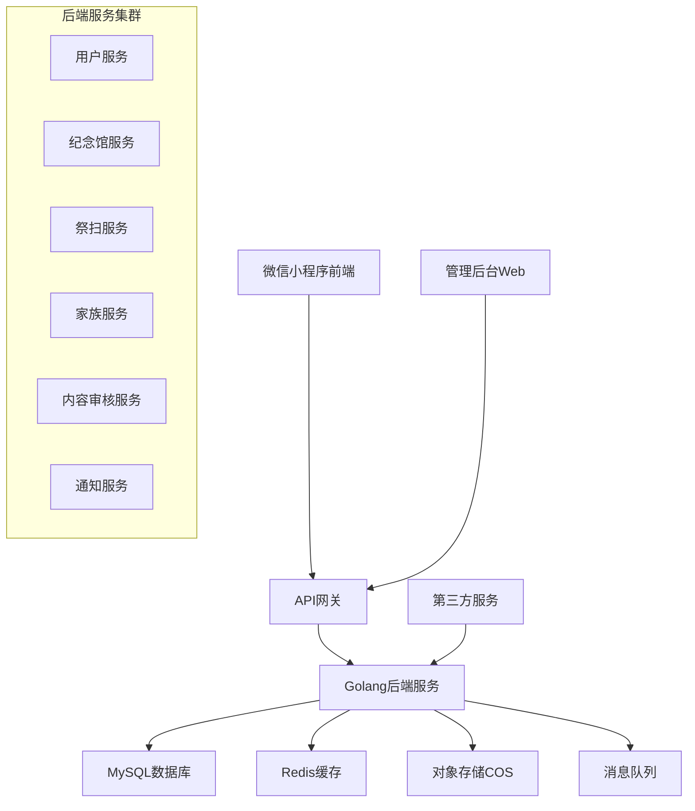
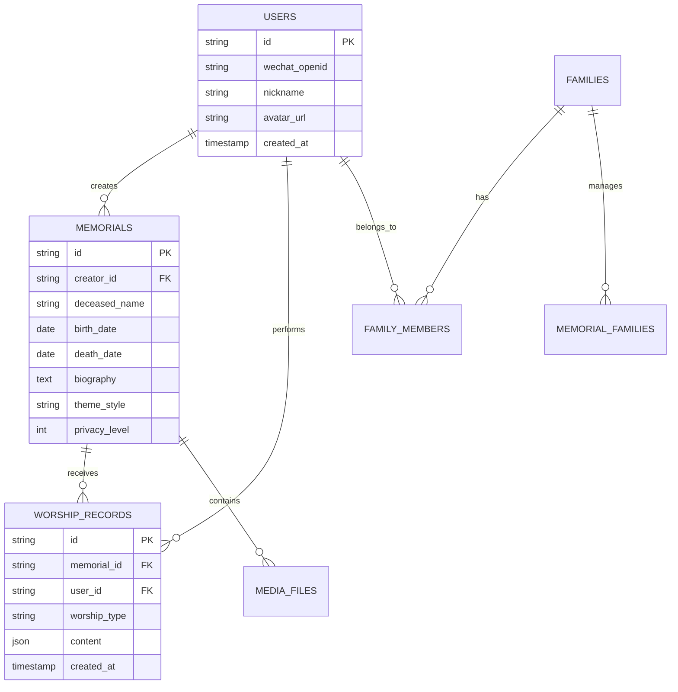

# 设计文档

## 概述

「云念」网上扫墓祭奠小程序是一个基于微信小程序平台的数字化纪念服务系统。系统采用前后端分离架构，前端使用微信小程序原生开发，后端使用Golang构建RESTful API服务，数据库采用MySQL存储关系型数据，Redis缓存热点数据，对象存储服务（如腾讯云COS）存储多媒体文件。

## 架构设计

### 整体架构



### 技术栈选择

**前端技术栈：**
- 微信小程序原生开发框架
- WeUI组件库（保证UI一致性）
- 微信小程序云开发（可选，用于快速原型）

**后端技术栈：**
- Golang 1.19+
- Gin Web框架
- GORM ORM框架
- JWT认证
- Go-Redis客户端

**数据存储：**
- MySQL 8.0（主数据库）
- Redis 6.0（缓存和会话）
- 腾讯云COS（文件存储）

**基础设施：**
- Docker容器化部署
- Nginx反向代理
- 腾讯云服务器

## 组件和接口设计

### 核心服务模块

#### 1. 用户服务 (User Service)

**职责：** 处理用户注册、登录、个人信息管理

**主要接口：**
```go
type UserService interface {
    // 微信登录
    WechatLogin(code string) (*LoginResponse, error)
    // 获取用户信息
    GetUserInfo(userID string) (*User, error)
    // 更新用户信息
    UpdateUserInfo(userID string, info *UserInfo) error
    // 获取用户权限
    GetUserPermissions(userID string) ([]Permission, error)
}
```

#### 2. 纪念馆服务 (Memorial Service)

**职责：** 纪念馆的创建、管理、装修等核心功能

**主要接口：**
```go
type MemorialService interface {
    // 创建纪念馆
    CreateMemorial(memorial *Memorial) (*Memorial, error)
    // 获取纪念馆详情
    GetMemorial(memorialID string) (*Memorial, error)
    // 更新纪念馆信息
    UpdateMemorial(memorialID string, memorial *Memorial) error
    // 上传纪念馆媒体文件
    UploadMedia(memorialID string, file *MediaFile) (*MediaFile, error)
    // 设置纪念馆隐私
    SetPrivacy(memorialID string, privacy *PrivacySetting) error
}
```

#### 3. 祭扫服务 (Worship Service)

**职责：** 处理各种祭扫行为和仪式

**主要接口：**
```go
type WorshipService interface {
    // 献花
    OfferFlowers(memorialID, userID string, flowers *FlowerOffering) error
    // 点烛
    LightCandle(memorialID, userID string, candle *CandleOffering) error
    // 上香
    OfferIncense(memorialID, userID string, incense *IncenseOffering) error
    // 供奉供品
    OfferTribute(memorialID, userID string, tribute *TributeOffering) error
    // 祈福留言
    CreatePrayer(memorialID, userID string, prayer *Prayer) error
    // 语音/视频留言
    CreateMessage(memorialID, userID string, message *Message) error
}
```

#### 4. 家族服务 (Family Service)

**职责：** 家族圈管理、成员邀请、动态同步

**主要接口：**
```go
type FamilyService interface {
    // 创建家族圈
    CreateFamily(family *Family) (*Family, error)
    // 邀请家族成员
    InviteMember(familyID, inviterID, inviteeID string) error
    // 获取家族动态
    GetFamilyActivities(familyID string, page int) (*ActivityList, error)
    // 同步祭扫动态
    SyncWorshipActivity(activity *WorshipActivity) error
    // 设置纪念日提醒
    SetMemorialReminder(reminder *MemorialReminder) error
}
```

#### 5. 内容审核服务 (Content Moderation Service)

**职责：** 内容安全审核、敏感词过滤

**主要接口：**
```go
type ModerationService interface {
    // 审核文本内容
    ModerateText(content string) (*ModerationResult, error)
    // 审核图片内容
    ModerateImage(imageURL string) (*ModerationResult, error)
    // 审核视频内容
    ModerateVideo(videoURL string) (*ModerationResult, error)
    // 获取敏感词列表
    GetSensitiveWords() ([]string, error)
}
```

### 前端组件架构

#### 页面结构
```
pages/
├── index/                 # 首页
├── memorial/             # 纪念馆相关页面
│   ├── create/          # 创建纪念馆
│   ├── detail/          # 纪念馆详情
│   ├── worship/         # 祭扫页面
│   └── edit/            # 编辑纪念馆
├── family/              # 家族圈页面
│   ├── list/           # 家族列表
│   ├── detail/         # 家族详情
│   └── create/         # 创建家族圈
├── profile/             # 个人中心
└── admin/               # 管理页面
```

#### 核心组件
```javascript
// 纪念馆组件
components/
├── MemorialCard/        # 纪念馆卡片
├── WorshipPanel/        # 祭扫操作面板
├── MediaUploader/       # 媒体上传组件
├── PrayerWall/          # 祈福墙
├── FamilyCircle/        # 家族圈组件
└── NotificationCenter/  # 通知中心
```

## 数据模型设计

### 核心数据表

#### 用户表 (users)
```sql
CREATE TABLE users (
    id VARCHAR(36) PRIMARY KEY,
    wechat_openid VARCHAR(100) UNIQUE NOT NULL,
    wechat_unionid VARCHAR(100),
    nickname VARCHAR(50),
    avatar_url VARCHAR(255),
    phone VARCHAR(20),
    created_at TIMESTAMP DEFAULT CURRENT_TIMESTAMP,
    updated_at TIMESTAMP DEFAULT CURRENT_TIMESTAMP ON UPDATE CURRENT_TIMESTAMP,
    status TINYINT DEFAULT 1 COMMENT '1:正常 0:禁用'
);
```

#### 纪念馆表 (memorials)
```sql
CREATE TABLE memorials (
    id VARCHAR(36) PRIMARY KEY,
    creator_id VARCHAR(36) NOT NULL,
    deceased_name VARCHAR(50) NOT NULL,
    birth_date DATE,
    death_date DATE,
    biography TEXT,
    avatar_url VARCHAR(255),
    theme_style VARCHAR(50) DEFAULT 'traditional',
    tombstone_style VARCHAR(50) DEFAULT 'marble',
    epitaph TEXT,
    privacy_level TINYINT DEFAULT 1 COMMENT '1:家族可见 2:私密',
    created_at TIMESTAMP DEFAULT CURRENT_TIMESTAMP,
    updated_at TIMESTAMP DEFAULT CURRENT_TIMESTAMP ON UPDATE CURRENT_TIMESTAMP,
    status TINYINT DEFAULT 1,
    FOREIGN KEY (creator_id) REFERENCES users(id)
);
```

#### 祭扫记录表 (worship_records)
```sql
CREATE TABLE worship_records (
    id VARCHAR(36) PRIMARY KEY,
    memorial_id VARCHAR(36) NOT NULL,
    user_id VARCHAR(36) NOT NULL,
    worship_type VARCHAR(20) NOT NULL COMMENT 'flower|candle|incense|tribute|prayer',
    content JSON,
    created_at TIMESTAMP DEFAULT CURRENT_TIMESTAMP,
    FOREIGN KEY (memorial_id) REFERENCES memorials(id),
    FOREIGN KEY (user_id) REFERENCES users(id)
);
```

#### 家族圈表 (families)
```sql
CREATE TABLE families (
    id VARCHAR(36) PRIMARY KEY,
    name VARCHAR(100) NOT NULL,
    creator_id VARCHAR(36) NOT NULL,
    description TEXT,
    invite_code VARCHAR(20) UNIQUE,
    created_at TIMESTAMP DEFAULT CURRENT_TIMESTAMP,
    updated_at TIMESTAMP DEFAULT CURRENT_TIMESTAMP ON UPDATE CURRENT_TIMESTAMP,
    FOREIGN KEY (creator_id) REFERENCES users(id)
);
```

#### 家族成员表 (family_members)
```sql
CREATE TABLE family_members (
    id VARCHAR(36) PRIMARY KEY,
    family_id VARCHAR(36) NOT NULL,
    user_id VARCHAR(36) NOT NULL,
    role VARCHAR(20) DEFAULT 'member' COMMENT 'admin|member',
    joined_at TIMESTAMP DEFAULT CURRENT_TIMESTAMP,
    FOREIGN KEY (family_id) REFERENCES families(id),
    FOREIGN KEY (user_id) REFERENCES users(id),
    UNIQUE KEY unique_family_user (family_id, user_id)
);
```

### 数据关系图



## 错误处理

### 错误码设计

```go
const (
    // 通用错误码
    ErrCodeSuccess     = 0
    ErrCodeInvalidParam = 1001
    ErrCodeUnauthorized = 1002
    ErrCodeForbidden   = 1003
    ErrCodeNotFound    = 1004
    ErrCodeInternalError = 1005
    
    // 用户相关错误码
    ErrCodeUserNotFound = 2001
    ErrCodeUserBanned   = 2002
    
    // 纪念馆相关错误码
    ErrCodeMemorialNotFound = 3001
    ErrCodeMemorialPrivate  = 3002
    ErrCodeMemorialLimit    = 3003
    
    // 家族相关错误码
    ErrCodeFamilyNotFound = 4001
    ErrCodeFamilyFull     = 4002
    ErrCodeAlreadyMember  = 4003
    
    // 内容审核错误码
    ErrCodeContentViolation = 5001
    ErrCodeSensitiveWord   = 5002
)
```

### 统一错误响应格式

```go
type APIResponse struct {
    Code    int         `json:"code"`
    Message string      `json:"message"`
    Data    interface{} `json:"data,omitempty"`
}

type ErrorDetail struct {
    Field   string `json:"field,omitempty"`
    Message string `json:"message"`
}
```

## 测试策略

### 测试层级

1. **单元测试**
   - 覆盖所有业务逻辑函数
   - 数据库操作的Mock测试
   - 第三方服务调用的Mock测试

2. **集成测试**
   - API接口测试
   - 数据库集成测试
   - 缓存集成测试

3. **端到端测试**
   - 关键业务流程测试
   - 微信小程序自动化测试

### 测试工具

- **后端测试：** Go testing包 + Testify + GoMock
- **API测试：** Postman + Newman
- **前端测试：** 微信开发者工具自动化测试
- **性能测试：** Apache JMeter

### 测试数据管理

```go
// 测试数据工厂
type TestDataFactory struct {
    db *gorm.DB
}

func (f *TestDataFactory) CreateTestUser() *User {
    user := &User{
        ID:          uuid.New().String(),
        WechatOpenID: "test_openid_" + uuid.New().String(),
        Nickname:    "测试用户",
        Status:      1,
    }
    f.db.Create(user)
    return user
}

func (f *TestDataFactory) CreateTestMemorial(creatorID string) *Memorial {
    memorial := &Memorial{
        ID:           uuid.New().String(),
        CreatorID:    creatorID,
        DeceasedName: "测试逝者",
        ThemeStyle:   "traditional",
        PrivacyLevel: 1,
    }
    f.db.Create(memorial)
    return memorial
}
```

## 安全考虑

### 认证与授权

1. **微信登录集成**
   - 使用微信小程序登录API
   - JWT Token管理用户会话
   - Token刷新机制

2. **权限控制**
   - 基于角色的访问控制(RBAC)
   - 纪念馆访问权限验证
   - 家族圈成员权限管理

### 数据安全

1. **敏感数据加密**
   - 用户手机号等敏感信息AES加密存储
   - 数据库连接SSL加密
   - API传输HTTPS加密

2. **内容安全**
   - 集成腾讯云内容安全API
   - 敏感词过滤
   - 图片、视频内容审核

### 防护措施

```go
// 接口限流中间件
func RateLimitMiddleware() gin.HandlerFunc {
    limiter := rate.NewLimiter(rate.Limit(100), 200) // 每秒100次请求，突发200次
    return gin.HandlerFunc(func(c *gin.Context) {
        if !limiter.Allow() {
            c.JSON(http.StatusTooManyRequests, APIResponse{
                Code:    1006,
                Message: "请求过于频繁，请稍后再试",
            })
            c.Abort()
            return
        }
        c.Next()
    })
}

// SQL注入防护
func (r *MemorialRepository) GetMemorialByID(id string) (*Memorial, error) {
    var memorial Memorial
    // 使用参数化查询防止SQL注入
    err := r.db.Where("id = ? AND status = ?", id, 1).First(&memorial).Error
    return &memorial, err
}
```

## 性能优化

### 缓存策略

1. **Redis缓存设计**
   - 用户信息缓存（TTL: 1小时）
   - 纪念馆基础信息缓存（TTL: 30分钟）
   - 热门祭扫记录缓存（TTL: 10分钟）

2. **缓存更新策略**
   - 写入时更新缓存
   - 定时刷新热点数据
   - 缓存穿透保护

### 数据库优化

1. **索引设计**
```sql
-- 纪念馆查询索引
CREATE INDEX idx_memorials_creator_status ON memorials(creator_id, status);
CREATE INDEX idx_memorials_privacy_status ON memorials(privacy_level, status);

-- 祭扫记录查询索引
CREATE INDEX idx_worship_memorial_time ON worship_records(memorial_id, created_at);
CREATE INDEX idx_worship_user_time ON worship_records(user_id, created_at);

-- 家族成员查询索引
CREATE INDEX idx_family_members_family ON family_members(family_id, role);
```

2. **分页查询优化**
```go
// 使用游标分页避免深度分页性能问题
func (r *WorshipRepository) GetWorshipRecords(memorialID string, cursor string, limit int) ([]*WorshipRecord, error) {
    query := r.db.Where("memorial_id = ?", memorialID)
    if cursor != "" {
        query = query.Where("id < ?", cursor)
    }
    
    var records []*WorshipRecord
    err := query.Order("id DESC").Limit(limit).Find(&records).Error
    return records, err
}
```

### CDN和静态资源优化

1. **媒体文件CDN加速**
   - 图片、视频文件使用腾讯云CDN
   - 多地域节点加速
   - 智能压缩和格式转换

2. **小程序包优化**
   - 代码分包加载
   - 图片资源压缩
   - 按需加载组件